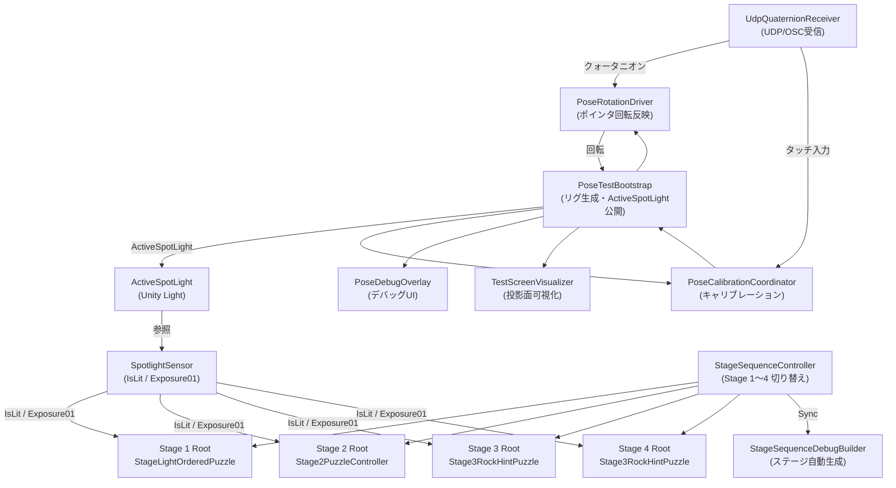

# アーキテクチャ概要

## システム全体の依存関係



---

## Pose / Projection 系

| コンポーネント | 役割 | 公開インタフェース |
|---|---|---|
| `PoseTestBootstrap` | 投影リグ自動生成、ライト生成 | `ActiveSpotLight`, `ViewerOriginTransform` |
| `UdpQuaternionReceiver` | UDP/OSC クォータニオン受信（別スレッド） | `ConsumeLatestRotation()`, `LatestConvertedRotation` |
| `PoseRotationDriver` | 受信クォータニオン → ポインタ回転反映 | `Configure()` |
| `PoseCalibrationCoordinator` | タッチ入力でゼロ点リセット | `Configure()` |
| `PoseDebugOverlay` | D キー/C キーのデバッグ UI | `Configure()` |
| `TestScreenVisualizer` | 投影面とライトの可視化 | `Configure()`, `ConfigureSurfaces()` |
| `ProjectionSurface` | 投影面の定義（Width / Height） | `Configure()` |
| `OffAxisProjectionCamera` | 非軸投影カメラ行列適用 | `Configure()` |
| `QuaternionCoordinateConverter` | iOS 座標系 → Unity 座標系変換 | `ConvertToUnity()` (static) |

---

## Stage 系（共通）

| コンポーネント | 役割 | 公開インタフェース |
|---|---|---|
| `StageSequenceController` | Stage 1〜4 の on/off 切り替え | `SetStage(int)`, `FadeToStage(int)`, `CurrentStageIndex` |
| `StageSequenceDebugBuilder` | デバッグ用ステージ自動生成（static） | `EnsureStageSetup()` |
| `StageRootMarker` | stage root 識別タグ | `StageIndex`, `StageName` |
| `SpotlightSensor` | ライト照射量計算（毎フレーム） | `IsLit`, `Exposure01`, `RefreshState()` |
| `StageSpotlightSettings` | ステージ別スポットライト設定を反映 | `ApplyTo(Light)` |
| `StageTransitionFader` | ステージ遷移フェード | `FadeOutIn(callback)` |
| `FaceCameraBillboard` | カメラ方向ビルボード | -(Update 自動処理) |

---

## Stage 1: 順番照射パズル

```
Stage1 Root
├── StageLightOrderedPuzzle   ← パズル制御
├── Creature 1 (Capsule)
│   ├── SpotlightSensor
│   └── StageLightCreatureTarget
├── Creature 2
│   └── ...
└── Stage1 Complete Marker (非表示)
```

**フロー**: `SpotlightSensor.IsLit` && `focusTimer >= requiredFocusSeconds` → `AdvanceProgress()` → 全完了 → `IsSolved = true`

---

## Stage 2: 記号解読 → コードロック

```
Stage2 Root
├── StageSymbolNumberRevealPuzzle  ← 前半パズル
├── StageLightCodeLockPuzzle       ← 後半パズル
├── Stage2PuzzleController         ← 前半→後半の調停
├── Stage2CompletionSequence       ← 完了演出
├── Stage2 Object 1 (□=4)
│   ├── SpotlightSensor
│   ├── StageSymbolNumberRevealTarget
│   └── StageSymbolMappingDisplay
│       └── Mapping Display (TextMesh + FaceCameraBillboard)
├── Stage2 Object 2 (△=3)  ...
├── Stage2 Object 3 (○=8)  ...
└── Code Lock Rig
    ├── StageCodeLockRig
    ├── Code Lock Panel (Cube)
    ├── Lock Door (Cube)
    └── Code Lock Content
        ├── Top Formula Root
        │   ├── SpotlightSensor
        │   ├── StageCodeFormulaDisplay
        │   └── Formula State Driver (TextMesh)
        ├── Dial Column 1
        │   ├── StageLightCodeDialColumn
        │   ├── Up Button (Cube)
        │   │   ├── SpotlightSensor
        │   │   └── StageCodeLockButtonIndicator
        │   ├── Digit Display (TextMesh + StageLightCodeDigitAnimator)
        │   └── Down Button ...
        ├── Dial Column 2  ...
        └── Dial Column 3  ...
```

**フロー**:
1. `StageSymbolNumberRevealPuzzle` → 3 ターゲット全照射 → `Stage2PuzzleController` へ通知
2. `Stage2PuzzleController` がコードロックを有効化
3. `StageLightCodeLockPuzzle` → ダイヤル操作 → コード `834` 一致 → `IsSolved`
4. `Stage2PuzzleController` が `Stage2CompletionSequence.Play()` を呼ぶ
5. 完了演出フェーズ: `DelayBeforeCollapse` → `Collapsing` → `DelayAfterCollapse` → `ExpandingLight` → `DelayAfterLight` → `SelfMove` → `Complete`
6. `StageSequenceController.FadeToStage(2)` で Stage 3 へ

---

## Stage 3 / Stage 4: カラーヒントロックパズル

```
Stage3(or4) Root
├── Stage3RockHintPuzzle
├── Stage3(4) Label (TextMesh)
├── Stage3(4) Puzzle Root
│   ├── Pedestal Row
│   │   ├── Red Pedestal / Green Pedestal / Blue Pedestal
│   │   │   ├── Base (Cylinder)
│   │   │   ├── Top (Cylinder)
│   │   │   └── [Color] Pedestal Rock (Sphere)
│   └── Hidden Hint Area
│       ├── Green Hint Rock (SpotlightSensor 付き)
│       └── Blue Hint Cave
│           └── Blue Hint Rock (SpotlightSensor 付き)
└── Stage3(4) Ground
```

**フロー**:
1. 緑ヒント岩 / 青ヒント岩をライト中心ゾーンで一定時間照射
2. 両方活性化 → `UpdateFinale()` 開始
3. `LocalReveal` → `PanoramaReveal` → `HoldBeforeTransition` → `Complete`
4. Stage 3 は Stage 4 へ遷移、Stage 4 は終端

**Stage 3 と Stage 4 の違い**:
| | Stage 3 | Stage 4 |
|---|---|---|
| `advanceToNextStage` | `true` | `false` |
| `nextStageIndex` | 3 (Stage 4) | 3 (参照のみ・遷移しない) |
| ヒント配置 | 左寄り | 右寄り |

---

## 主要な接続点まとめ

| 接続元 | 接続先 | 方法 |
|---|---|---|
| `PoseTestBootstrap` | ステージ系 | `ActiveSpotLight` プロパティ経由 |
| `SpotlightSensor` | `PoseTestBootstrap` | `FindFirstObjectByType` で自動解決 |
| `StageSequenceController` | `StageSequenceDebugBuilder` | `EnsureStageSetup()` 静的呼び出し |
| `Stage2CompletionSequence` | `StageSequenceController` | `FindFirstObjectByType` 経由で `FadeToStage()` |
| `Stage3RockHintPuzzle` | `StageSequenceController` | `FindFirstObjectByType` 経由で `FadeToStage()` |
| `PoseTestBootstrap` | `StageSequenceController` | `FindFirstObjectByType` でステージ番号監視 |
