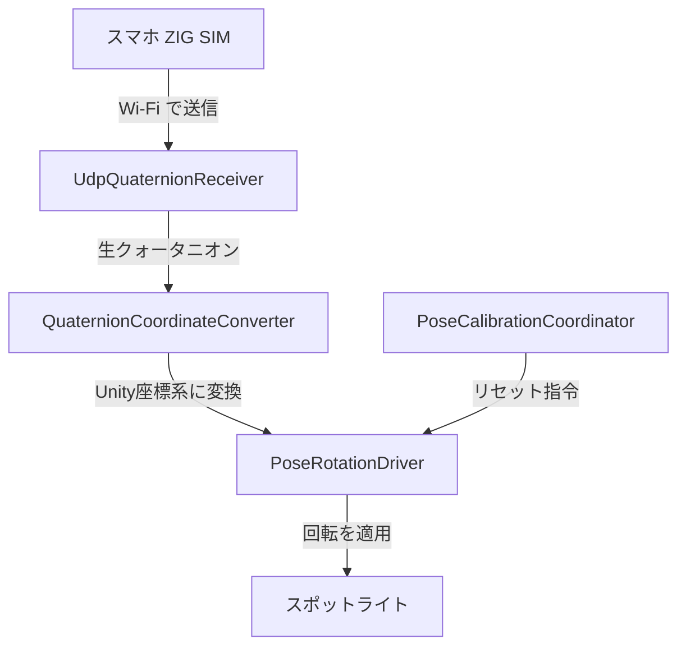

# 機能ガイド: スマホジャイロセンサー入力

> **難易度**: ★★★☆☆  
> **再利用度**: ⭐ 高い — スマホの姿勢で何かを操作するプロジェクト全般に応用可能  
> **依存パッケージ**: なし（Unity 標準 API のみ）

---

## この機能の概要

スマートフォン（iPhone / Android）に内蔵されている **ジャイロセンサー（姿勢センサー）** のデータを Unity に送り、Unity 上のスポットライトの向きをリアルタイムに操作する仕組みです。

スマホを懐中電灯のように持って傾けると、Unity の画面の中でスポットライトが同じように動きます。

### 使っているアプリ

**ZIG SIM** というスマホアプリを使います。このアプリはスマホのセンサーデータを Wi-Fi 経由で PC に送信してくれます（無料版あり）。

---

## 基本用語の解説

ここで使われる用語を先に説明します。

### UDP / OSC って何？（ケーブルではありません！）

**UDP** と **OSC** はどちらも **データの送り方のルール（プロトコル）** です。ケーブルではなく、Wi-Fi を通じてデータを送る方法の名前です。

| 用語 | 正式名称 | ひとことで言うと |
|------|---------|---------------|
| **UDP** | User Datagram Protocol | インターネットを使ってデータを送る方式の一つ。LINEメッセージを送るようなもの。速いけど「届いた確認」はしない |
| **OSC** | Open Sound Control | UDP の上に乗っかる「データの書き方ルール」。音楽やアート系でよく使われる。ZIG SIM はこの形式でデータを送る |

```
イメージ:
  Wi-Fi = 道路 (データが通る道)
  UDP   = 配達方法 (速達。届いた確認はしない)
  OSC   = 荷物の梱包方法 (中身をどう詰めるかのルール)
```

### クォータニオン (Quaternion) って何？

**3D空間での「向き」を表すデータ** です。4 つの数値 `(x, y, z, w)` で構成されます。

```
スマホを正面に持つ → (0, 0, 0, 1)
スマホを右に90°傾ける → (0, 0.707, 0, 0.707)
スマホを上に向ける → (0.707, 0, 0, 0.707)
```

「角度」でも向きは表現できますが、クォータニオンのほうが **計算が安定する**（ジンバルロックという問題が起きない）ので、3D プログラミングではクォータニオンが標準的に使われます。

### 「生クォータニオン」と「Unity 座標系クォータニオン」の違い

| 用語 | 意味 |
|------|------|
| **生クォータニオン** | スマホから届いたまま・変換前のデータ。iPhone と Android で数値の意味が違う |
| **Unity 座標系クォータニオン** | Unity で使える形に変換済みのデータ。こっちを使えば Unity のオブジェクトが正しく回転する |

なぜ変換が必要かというと、**iPhone と Unity では「どっちが右で、どっちが上か」のルールが違う** からです（後述の「座標系変換」で詳しく解説します）。

---

## データフロー図

スマホからスポットライトが動くまでの全体の流れです。



**各ブロックの役割:**

| ブロック | 何をしているか |
|---------|--------------|
| **スマホ ZIG SIM** | ジャイロセンサーが向きのデータを検出 |
| **Wi-Fi UDP/OSC** | UDP/OSC プロトコルでポート 8000 番にデータを送信 |
| **UdpQuaternionReceiver** | 別スレッドで UDP パケットを受信し、OSC/JSON/テキスト/バイナリを自動判別してデータ抽出 |
| **QuaternionCoordinateConverter** | iPhone / Android の座標系を Unity の座標系に変換 |
| **PoseRotationDriver** | キャリブレーション適用（今の向きを正面として基準設定）→ スポットライトの向きに反映 |
| **スポットライト** | スマホの動きに合わせてリアルタイムに回転 |
| **PoseCalibrationCoordinator** | C キー or スマホタッチでキャリブレーションをリセット |

---

## 関連ファイル

| ファイル | パス | 行数 | ひとことで言うと |
|---------|------|------|----------------|
| `UdpQuaternionReceiver.cs` | `Assets/Scripts/Pose/` | ~1637 | スマホからデータを受け取る係 |
| `QuaternionCoordinateConverter.cs` | `Assets/Scripts/Pose/` | ~216 | データを Unity 用に翻訳する係 |
| `QuaternionCalibrationUtility.cs` | `Assets/Scripts/Pose/` | ~10 | 回転の差分を計算する電卓 |
| `PoseRotationDriver.cs` | `Assets/Scripts/Pose/` | ~199 | 翻訳されたデータをスポットライトに適用する係 |
| `PoseCalibrationCoordinator.cs` | `Assets/Scripts/Pose/` | ~130 | 「今の向きを正面にする」リセットボタン係 |

---

## 各ファイルの詳細解説

### 1. UdpQuaternionReceiver.cs — スマホからデータを受け取る係

#### このファイルの役割

スマホアプリ（ZIG SIM）が Wi-Fi で送ってくる **向きのデータ** を、Unity 側で受け取るスクリプトです。

ポイントは **「別スレッド」** で動いていること。Unity のゲームは通常 1 つのメインスレッド（メインの処理の流れ）で動きますが、ネットワーク通信は「待ち時間」が発生するので、メインの処理を止めないように **別の処理ライン（スレッド）** で受信を行っています。

```
メインスレッド: ゲーム画面の描画、入力処理、物理演算... (60fps で忙しい)
受信スレッド:   ひたすら UDP パケットが届くのを待って、届いたら中身を読む
               ↓ データが来たら
               lock でメインスレッドに安全に渡す
```

> **スレッドとは**: プログラムの中で同時に動く「処理の流れ」のこと。料理に例えると、メインスレッドが「盛り付け担当」、受信スレッドが「仕込み担当」で、同時に別の作業をしています。

> **lock とは**: 2 つのスレッドが同時に同じデータを触ると壊れるので、「今このデータを使ってるから待って！」という鍵をかける仕組み。トイレの鍵のようなものです。

#### Inspector 設定 — 何のためにあるの？

Unity の Inspector は、**コードを書き換えずにパラメータを調整する画面** です。例えば「ポート番号を 8000 から 9000 に変えたい」とき、コードを編集しなくても Inspector 上のフィールドを書き換えるだけで済みます。

| フィールド | 型 | デフォルト | 何のために設定するか |
|-----------|-----|----------|-------------------|
| `listenPort` | int | `8000` | 「何番の入口でデータを待つか」。ZIG SIM 側の送信先ポートと同じ番号にする |
| `coordinatePreset` | enum | `IPhoneCoreMotion` | 「どの機種のスマホを使うか」。iPhone と Android で座標の決まりが違うため |
| `convertRightHandedToLeftHanded` | bool | `true` | 「座標系の変換をするか」。通常は true のまま |
| `screenFaceDown` | bool | `true` | 「スマホの画面を下に向けて使うか」。懐中電灯のように画面を下にして持つなら true |
| `stabilizeQuaternionHemisphere` | bool | `true` | 「回転データのブレを防止するか」。true のままで OK |

#### 受信スレッド処理 (`ReceiveLoop`)

```csharp
// ★ この関数は「別スレッド」で動く。メインスレッドとは別の処理ライン。
while (isRunning)
{
    // 1. UDP パケットが届くまで待つ（ここで処理がストップするが、
    //    別スレッドなのでゲーム画面は止まらない）
    byte[] packet = udpClient.Receive(ref remoteEndPoint);

    // 2. スマホの画面をタッチした？ → キャリブレーション（正面リセット）要求
    TryRequestRecenterFromTouchMessages(oscMessages);

    // 3. パケットの中身からクォータニオン(向きデータ)を取り出す
    //    ZIG SIM は 4 種類のフォーマットで送る可能性があるので順番に試す
    QuaternionPacketParseResult result = TryParseQuaternionPacket(packet);

    // 4. データをきれいにする（正規化＋半球安定化）
    Quaternion raw = StabilizeRawQuaternion(result.Quaternion);

    // 5. iPhone/Android の座標系 → Unity の座標系に変換
    Quaternion converted = QuaternionCoordinateConverter.ConvertToUnity(
        raw, coordinatePreset, eulerOffset, convertHandedness, screenFaceDown);

    // 6. メインスレッドに渡す（lock で鍵をかけて安全にデータを置く）
    lock (syncRoot)
    {
        pendingRotation = converted;
        hasPendingRotation = true;
    }
}
```

> **解説**:
> - **1行目 `while (isRunning)`**: ゲームが動いている間ずっとループする。1 回のループで 1 パケットを処理
> - **`udpClient.Receive()`**: ネットワークからデータが届くまで待つ関数。電話の受話器を取って相手が話すのを待つようなもの
> - **`TryParseQuaternionPacket()`**: 届いたバイト列（0 と 1 の羅列）から数値データ（クォータニオン）を取り出す。「手紙の封筒を開けて中身を読む」作業
> - **`StabilizeRawQuaternion()`**: クォータニオンには `q` と `-q` が同じ回転を表すという性質があり、フレームごとに符号がパタパタ切り替わることがある。これを防ぐ
> - **`ConvertToUnity()`**: iPhone の座標ルールを Unity の座標ルールに翻訳する（詳しくは後述）
> - **`lock (syncRoot) { ... }`**: 鍵をかけてデータを置く。メインスレッドがこのデータを読むときも同じ鍵を使う

#### パケットフォーマット判定 — なぜ 4 種類もあるの？

ZIG SIM のバージョンや設定によってデータの形式が変わるため、4 種類すべてに対応しています。上から順に試して、最初に成功したものを使います。

```csharp
// 優先順位の高い順に試す:
// 1. OSC バンドル (#bundle ヘッダがある)
//    → 複数のメッセージがまとめて入っている形式。再帰的に展開
// 2. OSC メッセージ (/ から始まる)
//    → 1つのメッセージ。float 値としてクォータニオンが入っている
// 3. JSON ({"quaternion": {"x": 0.1, "y": 0.2, ...}})
//    → テキスト形式。人間が読める
// 4. テキスト CSV (0.1, 0.2, 0.3, 0.4)
//    → カンマ区切りの数値テキスト
// 5. バイナリ 16byte (float × 4 をそのまま送信)
//    → 最もコンパクトだが人間には読めない
```

> **解説**:
> - **OSC**: 音楽・アート系のソフトで広く使われるフォーマット。メッセージに「アドレス」（例: `/quaternion`）と「値」（例: `0.1, 0.2, 0.3, 0.4`）がセットになっている
> - **JSON**: Web 開発でおなじみの `{ }` で囲まれたテキスト形式。読みやすいが少しデータサイズが大きい
> - **バイナリ**: float 型（4バイト）× 4 = 16 バイトをそのまま送る。一番小さくて速いが、中身を見ても人間には意味がわからない

#### メインスレッドとのデータ受け渡し

```csharp
// ★ メインスレッドの Update() 等から呼ぶメソッド

// 新しい回転データがあるか確認して取り出す
bool hasNew = receiver.ConsumeLatestRotation(out Quaternion rotation);
// → true なら rotation に新しいデータが入っている
// → false なら新しいデータはまだ来ていない

// スマホの画面タッチによるリセンター要求があるか確認
bool hasRecenter = receiver.ConsumePendingRecenterRequest();
// → true ならタッチされた → キャリブレーションリセットを実行

// スマホのタッチ位置を取り出す
bool hasTouch = receiver.ConsumePendingTouchPosition(out Vector2 position);
// → true ならタッチ位置が position に入っている
```

> **解説**:
> - **`Consume` という名前**: 「消費する」という意味。一度読んだらデータは消える（次に読むまで false を返す）。メールの「未読」が「既読」になるようなもの
> - **`out Quaternion rotation`**: C# の `out` キーワードは「この変数にデータを書き込んで返す」という意味。関数の戻り値とは別にデータを返す方法

---

### 2. QuaternionCoordinateConverter.cs — データを Unity 用に翻訳する係

#### なぜ座標変換が必要なのか？

iPhone、Android、Unity はそれぞれ **「どっちが X 軸の正方向か」** のルールが違います。

```
iPhone (CoreMotion):          Unity:
  +Y ↑                         +Y ↑
  +X →                         +X →
  +Z ● (手前に向かって)          +Z → (奥に向かって)
  右手系                        左手系

  → iPhone の +Z と Unity の +Z が逆！
```

> **右手系 / 左手系とは**: 親指(X)・人差し指(Y)・中指(Z) を立てたとき、右手で自然にできるのが「右手系」、左手でできるのが「左手系」。iPhone は右手系、Unity は左手系なので、Z 軸の向きが逆になります。

#### iPhone CoreMotion の変換ロジック

```csharp
// screenFaceDown = false の場合（画面が上を向いている）
return Quaternion.LookRotation(
    deviceTop.normalized,        // forward = スマホの先端が向いている方向
    -deviceScreenOut.normalized  // up = 画面裏方向
);

// screenFaceDown = true の場合（画面が下を向いている＝懐中電灯持ち）
return Quaternion.LookRotation(
    deviceTop.normalized,
    deviceScreenOut.normalized   // 反転しない（すでに裏向きと同じだから）
);
```

> **解説**:
> - **`Quaternion.LookRotation(forward, up)`**: 「forward 方向を向いて、up 方向を頭の上にする」回転を作る Unity の関数
> - **`deviceTop`**: スマホの上端（ノッチがある方）が向いている方向
> - **`deviceScreenOut`**: 画面が向いている方向（画面を見ている人の方向）
> - **`normalized`**: ベクトルの長さを 1 に揃える。方向だけが欲しいので長さは 1 で統一

#### Android RotationVector の変換

```csharp
// Android の座標系: ENU 右手系
//   E = East(東), N = North(北), U = Up(上)
//   X = 東, Y = 北, Z = 上

// Unity の座標系: 左手系
//   X = 右, Y = 上, Z = 奥

// 変換: Z 軸と W の符号を反転するだけ
// screenFaceDown = false
new Quaternion(q.x, q.y, -q.z, -q.w);

// screenFaceDown = true（画面下向き：X も反転して左右を補正）
new Quaternion(-q.x, q.y, -q.z, -q.w);
```

> **解説**:
> - 右手系→左手系の変換は **1 つの軸の符号を反転 + w の符号を反転** でできます
> - `screenFaceDown` が true のとき X も反転するのは、スマホを裏返すと左右が鏡像になるので、それを元に戻すためです

#### 半球安定化

```csharp
float dot = Quaternion.Dot(normalized, lastNormalized);
if (dot < 0f)
{
    // 前フレームと反対の半球にいる → 全成分の符号を反転して同じ半球に揃える
    normalized = new Quaternion(-q.x, -q.y, -q.z, -q.w);
}
```

> **解説**:
> - クォータニオン `(x, y, z, w)` と `(-x, -y, -z, -w)` は **数学的に全く同じ回転** を表します
> - しかし Unity で補間するとき、符号がフレームごとにパタパタ切り替わると **ガクッとジャンプして見える** ことがあります
> - `Quaternion.Dot()` は 2 つのクォータニオンの「近さ」を返します。負の値なら「反対側の半球にいる」ので符号を反転して揃えます
> - イメージ: 地球の北半球と南半球のように、クォータニオンにも 2 つの半球がある。同じ半球に揃えることで安定する

---

### 3. PoseRotationDriver.cs — スポットライトに回転を反映する係

#### このファイルの役割

`UdpQuaternionReceiver` で受信して変換されたクォータニオンを、実際にスポットライトの `transform.localRotation` に適用するスクリプトです。

ただし **そのまま適用するのではなく、キャリブレーション済みの「相対回転」** に変換します。

#### 相対回転とは？

```
例:
  キャリブレーション時のスマホの向き: 北を向いている
  今のスマホの向き: 東を向いている
  → 相対回転 = 「北からどれだけ回ったか」= 右に90°

  これをスポットライトに適用:
  → スポットライトも初期位置から右に90° 回転する
```

#### 相対回転の計算コード

```csharp
// キャリブレーション時のセンサー回転を保存（= 基準の向き）
referenceSensorRotation = firstPacketRotation;

// 毎フレーム: 基準からの相対回転を計算
Quaternion relativeRotation = Quaternion.Inverse(reference) * nextRotation;

// 相対回転をスポットライトに適用 (初期回転 + 相対回転 + オフセット)
targetLocalRotation = initialLocalRotation * relativeRotation * Quaternion.Euler(modelEulerOffset);
```

> **解説**:
> - **`Quaternion.Inverse(reference)`**: 基準回転の「逆回転」。「基準の向きまで戻す」操作
> - **`Inverse(reference) * nextRotation`**: 「基準まで戻してから今の回転を適用」= 「基準からどれだけ回ったか」= 相対回転
> - **`initialLocalRotation`**: ゲーム開始時のスポットライトの最初の向き
> - **`Quaternion.Euler(modelEulerOffset)`**: 3D モデルの向きが意図と違う場合に微調整する角度オフセット
> - 掛け算の順番が重要！クォータニオンの掛け算は **順番を変えると結果が変わります**（行列の掛け算と同じ）

#### 自動キャリブレーション

```csharp
// autoCalibrateOnFirstPacket = true のとき:
// 最初のパケットが届いた瞬間のスマホの向きを「正面」として基準にする
if (isFirstPacket && autoCalibrateOnFirstPacket)
{
    referenceSensorRotation = receivedRotation;  // 今の向き = 基準
    isCalibrated = true;
}
```

> **解説**:
> - ゲーム開始時、スマホがどんな向きでも「今の向きが正面」として自動で設定される
> - 後から C キーを押すと再キャリブレーション（今の向きを改めて正面に設定）できる

---

### 4. PoseCalibrationCoordinator.cs — 「正面リセット」ボタン係

#### このファイルの役割

「**今のスマホの向きを正面とする**」リセット操作を一括で実行するスクリプトです。

#### リセットのトリガー

```
C キー押下 → リセット実行
スマホ画面をタッチ → リセット実行
```

#### リセット時にやること

```csharp
void ResetAllCalibration()
{
    // 1. PoseRotationDriver の基準回転をリセット
    //    → 次のパケットで改めてキャリブレーション
    driver.ResetCalibration();

    // 2. 投影面上のポインタ表示をリセット
    visualizer.ResetReference();

    // 3. Viewer Origin（観察者の位置）と Rotation Pivot を初期位置に
    bootstrap.ResetViewerRigPose();
}
```

> **解説**:
> - 関連する 3 つのコンポーネントを **まとめてリセット** する調停役
> - 1 つずつ個別にリセットすると状態がズレるので、この 1 箇所でまとめて実行する設計

---

## 自分のプロジェクトで実装するには

### 最小構成（3 ファイル）

1. **`UdpQuaternionReceiver.cs`** をそのままコピー
2. **`QuaternionCoordinateConverter.cs`** をそのままコピー
3. **`QuaternionCalibrationUtility.cs`** をそのままコピー

### セットアップ手順

```
1. Unity で空の GameObject を作り、UdpQuaternionReceiver を付ける

2. Inspector で以下を設定:
   - listenPort = 8000 (ZIG SIM 側と同じ番号にする)
   - coordinatePreset = iPhone なら IPhoneCoreMotion / Android なら AndroidRotationVector
   - screenFaceDown = スマホの画面を下向きに持つなら true

3. 回転させたいオブジェクトの Update で:
   Quaternion rotation;
   if (receiver.ConsumeLatestRotation(out rotation))
   {
       transform.localRotation = rotation;
   }
```

> **解説**:
> - `ConsumeLatestRotation` が `true` を返したときだけ回転を更新する
> - `false` のときはまだ新しいデータが来ていないので、前の回転のままにする

### ZIG SIM 側の設定

```
- IP Address: PC のローカル IP アドレス（Windows で ipconfig コマンドで確認）
- Port Number: 8000 (Unity 側と一致させる)
- Protocol: UDP
- Format: JSON または OSC
- Sensor: Quaternion にチェック
```

### PoseRotationDriver を使う場合（キャリブレーション付き・推奨）

```csharp
// Configure で初期設定
driver.Configure(
    receiver,              // UDP 受信コンポーネント
    rotationTarget,        // 回転させたい Transform
    tipLight,              // 追従させるライト (不要なら null)
    tipLightForwardOffset  // ライトの前方オフセット距離
);

// C キー等でキャリブレーションリセット
driver.ResetCalibration();
```

> **解説**:
> - `PoseRotationDriver` を使うと「今の向きを正面にする」キャリブレーション機能が自動で付きます
> - `Configure()` はゲーム開始時に 1 回だけ呼ぶ初期設定メソッド

### デバッグ用 Python スクリプト

`zigsim_receiver.py` を使うと、**Unity を起動しなくても** ZIG SIM からデータが正しく届いているかターミナルで確認できます。

```bash
python zigsim_receiver.py --port 50000
```

---

## よくあるトラブルと対処法

| 症状 | 原因 | 対処 |
|------|------|------|
| 回転が反映されない | ポートが Windows ファイアウォールでブロックされている | 「Windows セキュリティ」→「ファイアウォール」→ UDP 8000 番を許可 |
| 左右が逆 | `screenFaceDown` の設定がスマホの持ち方と合っていない | 画面下向きなら `true`、画面上向きなら `false` |
| 回転がカクカク | Wi-Fi が不安定 or パケットが失われている | ルーターに近づく / 5GHz 帯を使う |
| 回転方向がおかしい | `coordinatePreset` が iPhone/Android と合っていない | iPhone なら `IPhoneCoreMotion`、Android なら `AndroidRotationVector` |
| 急に 180° ジャンプする | 半球安定化が無効 | `stabilizeQuaternionHemisphere = true` にする |
